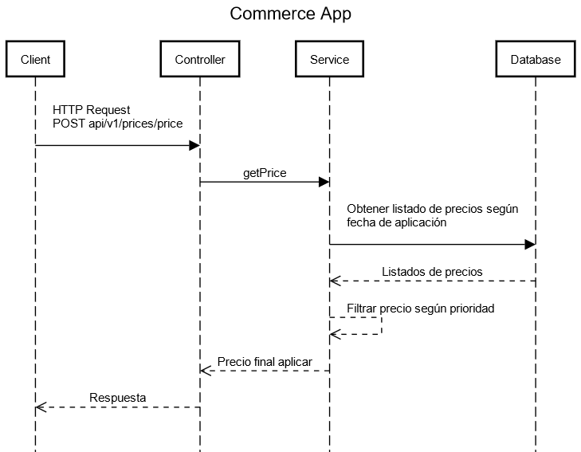

### Resumen

Está aplicación consulta la base de datos de un comercio electrónico para obtener una tarifa y un precio final que se le 
aplica a un producto entre unas fechas determinadas

### Requerimientos

Para correr la aplicación debes cumplir con los siguientes requerimientos:

- Tener java 17 instalado en tu computadora y haber configurado la variable de entorno JAVA_HOME.
- Maven versión 3 o superior

# Diagrama de secuencia



### ejecutar la aplicación

- Para iniciar la aplicación puedes ejecutar la clase principal (CommerceAppApplication.java) desde cualquier IDE.
- Desde la consola (estando en la raiz del proyecto, en nuestro caso dentro del directorio commerceApp), puedes ejecutar el comando:

```bash
mvn spring-boot:run
```

### Endpoints

- **'POST localhost:8080/api/v1/prices/price'**:  Obtiene el precio final aplicado a un producto, dada una fecha de aplicación, id del producto y id de la cadena.

```json
{
  "applicationDate": "2020-06-14 10:00:00",
  "productId": 35455,
  "brandId": 2
}
```

Puedes encontrar más ejemplos en la colección adjunta de Postman.

### Información adicional

Si tienes alguna duda no dudes en contactarme al correo [abrilrdev@gmail.com](mailto:abrilrdev@gmail.com).
